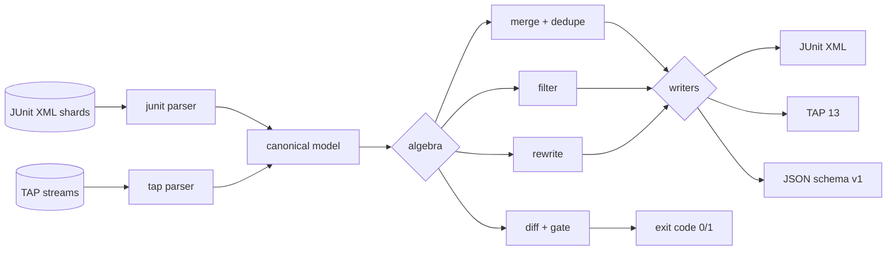

# muxunit

[English](README.md) | [中文](README.zh.md) | [日本語](README.ja.md)

[](LICENSE) [](go.mod) [](CHANGELOG.md)  [](CONTRIBUTING.md)

**muxunit：CI シャードをまたいで JUnit と TAP のレポートをマージ・差分・フィルタ・書き換えする、オープンソースで依存ゼロの CLI——単機能コンバータではなく、静的バイナリ 1 つに収めた完全なレポート代数ツールキット。**


```bash
git clone https://github.com/JaydenCJ/muxunit && cd muxunit
go build -o muxunit ./cmd/muxunit    # single static binary, stdlib only
```

> プレリリース：v0.1.0 はまだどのパッケージレジストリにもタグ付けされていません。上記の手順でソースからビルドしてください（Go ≥1.22 なら何でも可）。

## なぜ muxunit？

シャード化された CI はパイプラインごとに何十もの部分レポートを吐き出します——ユニットテストのシャードからは JUnit XML、bats や prove からは TAP、そして flaky テストがようやく通ったリトライ用シャード——その山を CI UI とマージゲートが消費できる 1 つの成果物に変える何かが必要です。多くのチームが実際に動かしているのは、壊れやすい `xmlstarlet`/`jq`/Python の場当たりスクリプトで、ファイルを連結するだけ、リトライしたテストは二重に数え、途中で切れた TAP ストリームは黙って飲み込み、「この失敗は*新規*か？」を一切知りません。単機能コンバータは存在しますが、変換で止まります。muxunit はレポートを小さな代数の値として扱います——**merge**（リトライを理解する重複解決ポリシー付き）、**diff**（変更のバケット分類 + リグレッション終了コードゲート）、**filter**（ステータス + glob 選択）、**rewrite**（スイート改名、sed 風ケース改名、時間のスクラブ）——すべてが 1 つの正準モデル上で動き、シャードの到着順に依存しないバイト同一の決定的出力を持ち、醜いケースも正直に扱います：8 件を約束して 5 件しか届かなかった TAP プランは 3 件の可視な error になり、決して緑のレポートを装いません。

| | muxunit | junit-merge (npm) | junitparser (PyPI) | シェルの場当たり |
|---|---|---|---|---|
| JUnit シャードのマージ | ✅ | ✅ | ✅ | 壊れやすい |
| TAP の読み書きにも対応 | ✅ | ❌ | ❌ | ❌ |
| リトライを理解する重複解決（`prefer-pass`/`prefer-fail`） | ✅ | ❌ | ❌ | ❌ |
| リグレッション終了コードゲート付き diff | ✅ | ❌ | ❌ | ❌ |
| フィルタ / 改名 / 書き換え操作 | ✅ | ❌ | 一部、ライブラリとして | XML に sed |
| 途切れたストリームの検出 | ✅ | ❌ | ❌ | ❌ |
| 決定的で順序非依存の出力 | ✅ | ❌ | ❌ | ❌ |
| ランタイム依存 | 0（静的バイナリ） | Node + 依存 | Python + 依存 | bash + 各種ツール |

<sub>依存数の確認日 2026-07-13：muxunit は Go 標準ライブラリのみを import。junit-merge は npm から 8 パッケージを取得、junitparser はすべての CI イメージに Python ランタイムを要求します。</sub>

## 特徴

- **1 つのモデル、2 つの方言** — 現実世界の JUnit XML（pytest・Gradle・Surefire・go-junit-report の癖、ネストしたスイート、ロケールで崩れた時間）と TAP 12–14（ディレクティブ、YAML 診断ブロック、bail-out）を寛容にパースし、両方に厳密で決定的な書き出し、さらに JSON も。
- **リトライを理解する merge** — シャード間で重複するテストキーをポリシーで解決：`all`、`first`、`last`、`prefer-pass`（リトライで緑になった flaky は合格扱い）、`prefer-fail`（一度でも赤ならテストは赤のまま）。
- **レビュアーのように門番する diff** — 変更を new-failures / fixed / still-failing / added / removed にバケット分類。終了コード 1 は*新規*の赤だけなので、既存の失敗は見え続けたままゲートを再発火させません。
- **フィルタと隔離** — ステータス（`--only-failed`）と `suite/class/name` ID 上の `*`/`**`/`?` glob でケースを選択。`--invert` は隔離セット*以外*のすべてを抽出します。
- **レポート衛生のための rewrite** — スイートの厳密改名、シャードラベルの接頭辞の付与/除去、キャプチャグループ対応の sed 風 `--sub /re/repl/` ケース改名、classname のスクラブ、再現可能な成果物のための `--strip-times`。
- **途切れは決して緑にならない** — TAP プランの欠けたポイントは可視の `error` ケースとして合成され、bail-out も error になります。クラッシュしたランナーが「合格」レポートをゲートに忍び込ませることはできません。
- **パイプラインのための設計** — フォーマット自動検出、`-` で stdin、`-o` でファイル出力、安定した終了コード（0 正常 / 1 ゲート / 2 用法 / 3 実行時）、バージョン付き JSON エンベロープ、ネットワークゼロ、テレメトリゼロ。

## クイックスタート

```bash
# fabricate demo shards: 2x JUnit + 1x TAP + a retry where the flake passed
bash examples/make-shards.sh demo
./muxunit merge --dedupe prefer-pass -o merged.xml demo/*.xml demo/*.tap
./muxunit summary merged.xml
```

実際にキャプチャした出力：

```text
suite   total    pass    fail   error    skip       time
api         3       3       0       0       0     0.820s
e2e         3       1       1       0       1     0.000s
web         1       1       0       0       0     0.120s
TOTAL       7       5       1       0       1     0.940s
```

リグレッションでパイプラインに門番を立てる — `./muxunit diff demo/retry.xml demo/shard-1.xml` は*新しい*失敗が 1 件あるため終了コード 1 になる（実出力）：

```text
new failures (1)
  api/Auth/rejects bad email  pass -> fail  (expected 422, got 500)
added (1)
  api/Auth/creates a user  pass
old: 1 test (0 red)  new: 2 tests (1 red)
diff: REGRESSIONS
```

赤いケースだけを再実行リストとして抜き出す — `./muxunit filter --only-failed --to tap merged.xml`（実出力）：

```text
TAP version 13
1..1
not ok 1 - checkout flow
  ---
  severity: fail
  detail: |
    message: button not found
  ...
```

## コマンド

`muxunit <merge|diff|filter|rewrite|summary|version> [flags] <report>...` — 入力は JUnit XML または TAP で自動検出（`--from` で強制）。`-` は stdin を読みます。終了コード：0 正常、1 ゲート発火、2 用法エラー、3 実行時エラー。

| コマンド | 動作 | ゲート |
|---|---|---|
| `merge` | シャードを 1 つのレポートに統合（`--dedupe`、`--to junit\|tap\|json`、`-o`） | — |
| `diff <old> <new>` | 変更をバケット分類し、テキストまたは `--format json` で出力 | `--fail-on` に応じて終了コード 1 |
| `filter` | 一致するケースだけ残す（`--status`、`--only-failed`、`--match`、`--invert`） | — |
| `rewrite` | 改名/スクラブ（`--rename-suite`、`--add/trim-prefix`、`--sub`、`--strip-times`） | — |
| `summary` | スイート別カウント表または `--format json` | `--check` 付きで終了コード 1 |

| キー | 既定値 | 効果 |
|---|---|---|
| `--dedupe` | `all` | 重複ポリシー：`all`、`first`、`last`、`prefer-pass`、`prefer-fail` |
| `--to` / `--from` | `junit` / `auto` | 出力フォーマット / 入力フォーマットの強制 |
| `--fail-on`（diff） | `regressions` | ゲートモード：`regressions`、`any-change`、`nothing` |
| `--match`（filter） | — | `suite/class/name` への glob。`*` はセグメント内、`**` は跨ぎ（繰り返し可） |
| `--sub`（rewrite） | — | ケース名への sed 風 `/pattern/replacement/`（繰り返し可） |
| `-o` | stdout | 結果のレポートをファイルへ書き出す |

完全なセマンティクス——識別キー、重複解決のタイブレーク、diff バケット、TAP マッピング——は [docs/report-algebra.md](docs/report-algebra.md) に。

## 検証

このリポジトリは CI を同梱しません。上記の主張はすべてローカル実行で検証します：

```bash
go test ./...            # 89 deterministic tests, offline, < 5 s
bash scripts/smoke.sh    # end-to-end CLI check, prints SMOKE OK
```

## アーキテクチャ



## ロードマップ

- [x] v0.1.0 — JUnit + TAP のパース/書き出し、5 つの重複ポリシーを持つ merge、リグレッション門番の diff、glob filter、sed 風 rewrite、summary ゲート、89 テスト + smoke スクリプト
- [ ] `--flaky-report`：実行をまたぐ重複分析で最も flaky なテストを名指し
- [ ] 時間の diff（`--slower-than 20%`）でテストの性能リグレッションを捕捉
- [ ] SubUnit と go `test2json` の入力方言
- [ ] `split` 動詞：1 つのレポートを再実行用に N 個の均衡シャードへ再分割
- [ ] PR コメント向けの Markdown 出力

全リストは [open issues](https://github.com/JaydenCJ/muxunit/issues) を参照してください。

## コントリビュート

Issue・議論・PR を歓迎します——ローカルのワークフロー（format、vet、テスト、`SMOKE OK`）は [CONTRIBUTING.md](CONTRIBUTING.md) へ。入門向けタスクは [good first issue](https://github.com/JaydenCJ/muxunit/issues?q=is%3Aissue+is%3Aopen+label%3A%22good+first+issue%22) のラベル付き、設計の話題は [Discussions](https://github.com/JaydenCJ/muxunit/discussions) で。

## ライセンス

[MIT](LICENSE)
