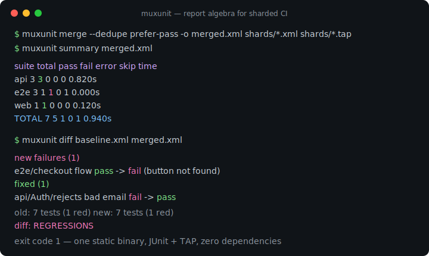
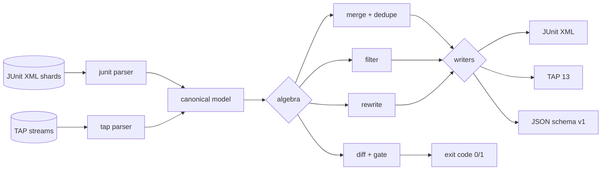

# muxunit

[English](README.md) | [中文](README.zh.md) | [日本語](README.ja.md)

[](LICENSE) [](go.mod) [](CHANGELOG.md)  [](CONTRIBUTING.md)

**muxunit：an open-source, zero-dependency CLI that merges, diffs, filters, and rewrites JUnit and TAP reports across CI shards — a complete report-algebra toolkit in one static binary, not another single-purpose converter.**



```bash
git clone https://github.com/JaydenCJ/muxunit && cd muxunit
go build -o muxunit ./cmd/muxunit    # single static binary, stdlib only
```

> Pre-release: v0.1.0 is not tagged on a package registry yet; build from source as above (any Go ≥1.22).

## Why muxunit?

Sharded CI produces dozens of partial reports per pipeline — JUnit XML from the unit shards, TAP from bats or prove, a retry shard where the flake finally passed — and something has to turn that pile into one artifact the CI UI and the merge gate can consume. What most teams actually run is a fragile `xmlstarlet`/`jq`/Python-one-off that concatenates files, double-counts retried tests, silently swallows a truncated TAP stream, and knows nothing about "is this failure *new*?". Single-purpose converters exist, but they stop at conversion. muxunit treats reports as values in a small algebra — **merge** (with retry-aware dedupe policies), **diff** (bucketed changes with a regression exit-code gate), **filter** (status + glob selection), **rewrite** (suite renames, sed-style case renames, time scrubbing) — over one canonical model, with deterministic byte-identical output regardless of shard arrival order, and honest handling of the ugly cases: a TAP plan that promised 8 tests and delivered 5 becomes 3 visible errors, never a green report.

| | muxunit | junit-merge (npm) | junitparser (PyPI) | shell one-offs |
|---|---|---|---|---|
| Merges JUnit shards | ✅ | ✅ | ✅ | fragile |
| Reads and writes TAP too | ✅ | ❌ | ❌ | ❌ |
| Retry-aware dedupe (`prefer-pass`/`prefer-fail`) | ✅ | ❌ | ❌ | ❌ |
| Diff with regression exit-code gate | ✅ | ❌ | ❌ | ❌ |
| Filter / rename / rewrite operations | ✅ | ❌ | partial, as a library | sed on XML |
| Truncated-stream detection | ✅ | ❌ | ❌ | ❌ |
| Deterministic, order-independent output | ✅ | ❌ | ❌ | ❌ |
| Runtime dependencies | 0 (static binary) | Node + deps | Python + deps | bash + tools |

<sub>Dependency counts checked 2026-07-13: muxunit imports the Go standard library only; junit-merge pulls 8 packages from npm, junitparser needs a Python runtime on every CI image.</sub>

## Features

- **One model, two dialects** — liberal parsers for real-world JUnit XML (pytest, Gradle, Surefire, go-junit-report quirks; nested suites; locale-mangled durations) and TAP 12–14 (directives, YAML diagnostics, bail-outs), strict deterministic writers for both, plus JSON.
- **Retry-aware merge** — duplicate test keys across shards resolve by policy: `all`, `first`, `last`, `prefer-pass` (retried flakes count green), `prefer-fail` (any red run keeps the test red).
- **Diff that gates like a reviewer** — changes bucket into new-failures / fixed / still-failing / added / removed; exit 1 only on *new* red, so pre-existing failures stay visible without re-tripping the gate.
- **Filter and quarantine** — select cases by status (`--only-failed`) and by `*`/`**`/`?` globs over `suite/class/name` IDs; `--invert` extracts everything *except* the quarantined set.
- **Rewrite for report hygiene** — exact suite renames, prefix add/trim for shard labels, sed-style `--sub /re/repl/` case renames with capture groups, classname scrubbing, `--strip-times` for reproducible artifacts.
- **Truncation is never green** — a TAP plan with missing points synthesizes visible `error` cases, and bail-outs become errors; a crashed runner can't sneak a passing report past the gate.
- **Built for pipelines** — format auto-detection, stdin via `-`, `-o` file output, stable exit codes (0 ok / 1 gate / 2 usage / 3 runtime), versioned JSON envelope, zero network, zero telemetry.

## Quickstart

```bash
# fabricate demo shards: 2x JUnit + 1x TAP + a retry where the flake passed
bash examples/make-shards.sh demo
./muxunit merge --dedupe prefer-pass -o merged.xml demo/*.xml demo/*.tap
./muxunit summary merged.xml
```

Real captured output:

```text
suite   total    pass    fail   error    skip       time
api         3       3       0       0       0     0.820s
e2e         3       1       1       0       1     0.000s
web         1       1       0       0       0     0.120s
TOTAL       7       5       1       0       1     0.940s
```

Gate a pipeline on regressions — `./muxunit diff demo/retry.xml demo/shard-1.xml` exits 1 because one failure is *new* (real output):

```text
new failures (1)
  api/Auth/rejects bad email  pass -> fail  (expected 422, got 500)
added (1)
  api/Auth/creates a user  pass
old: 1 test (0 red)  new: 2 tests (1 red)
diff: REGRESSIONS
```

Extract just the red cases as a rerun list — `./muxunit filter --only-failed --to tap merged.xml` (real output):

```text
TAP version 13
1..1
not ok 1 - checkout flow
  ---
  severity: fail
  detail: |
    message: button not found
  ...
```

## Commands

`muxunit <merge|diff|filter|rewrite|summary|version> [flags] <report>...` — inputs are JUnit XML or TAP, auto-detected (force with `--from`); `-` reads stdin. Exit codes: 0 ok, 1 gate breached, 2 usage error, 3 runtime error.

| Command | Does | Gate |
|---|---|---|
| `merge` | combine shards into one report (`--dedupe`, `--to junit\|tap\|json`, `-o`) | — |
| `diff <old> <new>` | bucket changes, print text or `--format json` | exit 1 per `--fail-on` |
| `filter` | keep matching cases (`--status`, `--only-failed`, `--match`, `--invert`) | — |
| `rewrite` | rename/scrub (`--rename-suite`, `--add/trim-prefix`, `--sub`, `--strip-times`) | — |
| `summary` | per-suite counts table or `--format json` | exit 1 with `--check` |

| Key | Default | Effect |
|---|---|---|
| `--dedupe` | `all` | duplicate policy: `all`, `first`, `last`, `prefer-pass`, `prefer-fail` |
| `--to` / `--from` | `junit` / `auto` | output format / forced input format |
| `--fail-on` (diff) | `regressions` | gate mode: `regressions`, `any-change`, `nothing` |
| `--match` (filter) | — | glob over `suite/class/name`; `*` in-segment, `**` across (repeatable) |
| `--sub` (rewrite) | — | sed-style `/pattern/replacement/` on case names (repeatable) |
| `-o` | stdout | write the resulting report to a file |

Full semantics — identity keys, dedupe tie-breaks, diff buckets, TAP mapping — in [docs/report-algebra.md](docs/report-algebra.md).

## Verification

This repository ships no CI; every claim above is verified by local runs:

```bash
go test ./...            # 89 deterministic tests, offline, < 5 s
bash scripts/smoke.sh    # end-to-end CLI check, prints SMOKE OK
```

## Architecture



## Roadmap

- [x] v0.1.0 — JUnit + TAP parse/write, merge with 5 dedupe policies, regression-gating diff, glob filter, sed-style rewrite, summary gate, 89 tests + smoke script
- [ ] `--flaky-report`: cross-run duplicate analysis that names the flakiest tests
- [ ] Duration diffing (`--slower-than 20%`) to catch performance regressions in tests
- [ ] SubUnit and go `test2json` input dialects
- [ ] `split` verb: partition one report back into N balanced shards for re-runs
- [ ] Markdown output for PR comments

See the [open issues](https://github.com/JaydenCJ/muxunit/issues) for the full list.

## Contributing

Issues, discussions and pull requests are welcome — see [CONTRIBUTING.md](CONTRIBUTING.md) for the local workflow (format, vet, tests, `SMOKE OK`). Good entry points are labelled [good first issue](https://github.com/JaydenCJ/muxunit/issues?q=is%3Aissue+is%3Aopen+label%3A%22good+first+issue%22), and design questions live in [Discussions](https://github.com/JaydenCJ/muxunit/discussions).

## License

[MIT](LICENSE)
