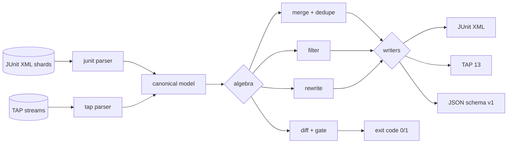

# muxunit

[English](README.md) | [中文](README.zh.md) | [日本語](README.ja.md)

[](LICENSE) [](go.mod) [](CHANGELOG.md)  [](CONTRIBUTING.md)

**muxunit：开源、零依赖的 CLI，跨 CI 分片合并、对比、筛选、改写 JUnit 与 TAP 报告——一个静态二进制里的完整报告代数工具箱，而不是又一个单一用途的转换器。**


```bash
git clone https://github.com/JaydenCJ/muxunit && cd muxunit
go build -o muxunit ./cmd/muxunit    # single static binary, stdlib only
```

> 预发布：v0.1.0 尚未在任何包仓库打 tag；请按上述方式从源码构建（任意 Go ≥1.22）。

## 为什么选 muxunit？

分片 CI 每条流水线都会产出几十份局部报告——单测分片吐 JUnit XML，bats 或 prove 吐 TAP，还有一份 flaky 用例终于跑绿的重试分片——总得有东西把这堆文件变成 CI UI 和合并门禁能消费的单一产物。大多数团队实际在跑的，是一段脆弱的 `xmlstarlet`/`jq`/Python 临时脚本：只会拼接文件、把重试用例算两遍、悄悄吞掉被截断的 TAP 流，更完全不知道"这个失败是*新出现的*吗？"。单一用途的转换器是有，但止步于转换。muxunit 把报告当作一门小代数里的值——**merge**（带感知重试的去重策略）、**diff**（分桶变更 + 回归退出码门禁）、**filter**（状态 + glob 选择）、**rewrite**（套件重命名、sed 风格用例改名、时长清洗）——全部作用于同一个规范模型，输出确定且与分片到达顺序无关（字节级一致），并诚实处理丑陋场景：计划 8 个用例只到 5 个的 TAP 流会变成 3 个可见的 error，绝不会伪装成绿色报告。

| | muxunit | junit-merge (npm) | junitparser (PyPI) | shell 临时脚本 |
|---|---|---|---|---|
| 合并 JUnit 分片 | ✅ | ✅ | ✅ | 脆弱 |
| 同时读写 TAP | ✅ | ❌ | ❌ | ❌ |
| 感知重试的去重（`prefer-pass`/`prefer-fail`） | ✅ | ❌ | ❌ | ❌ |
| 带回归退出码门禁的 diff | ✅ | ❌ | ❌ | ❌ |
| 筛选 / 重命名 / 改写操作 | ✅ | ❌ | 部分，需当库用 | 对 XML 上 sed |
| 截断流检测 | ✅ | ❌ | ❌ | ❌ |
| 确定性、与顺序无关的输出 | ✅ | ❌ | ❌ | ❌ |
| 运行时依赖 | 0（静态二进制） | Node + 依赖 | Python + 依赖 | bash + 各种工具 |

<sub>依赖数核查于 2026-07-13：muxunit 只 import Go 标准库；junit-merge 从 npm 拉 8 个包，junitparser 要求每个 CI 镜像都装 Python 运行时。</sub>

## 特性

- **一个模型，两种方言** — 对真实世界 JUnit XML（pytest、Gradle、Surefire、go-junit-report 的怪癖；嵌套套件；被 locale 弄乱的时长）与 TAP 12–14（directive、YAML 诊断块、bail-out）宽容解析，对两者都严格、确定地写出，另加 JSON。
- **感知重试的 merge** — 跨分片重复的测试键按策略消解：`all`、`first`、`last`、`prefer-pass`（重试转绿的 flaky 算通过）、`prefer-fail`（任何一次红就保持红）。
- **像 reviewer 一样把关的 diff** — 变更分桶为 new-failures / fixed / still-failing / added / removed；只有*新*红才退出码 1，既让存量失败保持可见，又不会反复触发门禁。
- **筛选与隔离** — 按状态（`--only-failed`）以及 `suite/class/name` ID 上的 `*`/`**`/`?` glob 选择用例；`--invert` 提取隔离集*之外*的一切。
- **报告卫生用的 rewrite** — 精确套件重命名、分片标签的前缀增删、带捕获组的 sed 风格 `--sub /re/repl/` 用例改名、classname 清洗、可复现产物用的 `--strip-times`。
- **截断绝不算绿** — TAP 计划缺少的点会合成可见的 `error` 用例，bail-out 也变成 error；崩掉的 runner 无法把一份"通过"的报告偷运过门禁。
- **为流水线而生** — 格式自动检测、`-` 读 stdin、`-o` 写文件、稳定退出码（0 正常 / 1 门禁 / 2 用法 / 3 运行时）、带版本号的 JSON envelope、零网络、零遥测。

## 快速上手

```bash
# fabricate demo shards: 2x JUnit + 1x TAP + a retry where the flake passed
bash examples/make-shards.sh demo
./muxunit merge --dedupe prefer-pass -o merged.xml demo/*.xml demo/*.tap
./muxunit summary merged.xml
```

真实捕获的输出：

```text
suite   total    pass    fail   error    skip       time
api         3       3       0       0       0     0.820s
e2e         3       1       1       0       1     0.000s
web         1       1       0       0       0     0.120s
TOTAL       7       5       1       0       1     0.940s
```

用回归为流水线把关 —— `./muxunit diff demo/retry.xml demo/shard-1.xml` 因出现一个*新*失败而以退出码 1 结束（真实输出）：

```text
new failures (1)
  api/Auth/rejects bad email  pass -> fail  (expected 422, got 500)
added (1)
  api/Auth/creates a user  pass
old: 1 test (0 red)  new: 2 tests (1 red)
diff: REGRESSIONS
```

只把红色用例提取成重跑清单 —— `./muxunit filter --only-failed --to tap merged.xml`（真实输出）：

```text
TAP version 13
1..1
not ok 1 - checkout flow
  ---
  severity: fail
  detail: |
    message: button not found
  ...
```

## 命令

`muxunit <merge|diff|filter|rewrite|summary|version> [flags] <report>...` — 输入为 JUnit XML 或 TAP，自动检测（用 `--from` 强制）；`-` 读 stdin。退出码：0 正常，1 门禁触发，2 用法错误，3 运行时错误。

| 命令 | 作用 | 门禁 |
|---|---|---|
| `merge` | 把分片合并为一份报告（`--dedupe`、`--to junit\|tap\|json`、`-o`） | — |
| `diff <old> <new>` | 变更分桶，输出文本或 `--format json` | 按 `--fail-on` 退出码 1 |
| `filter` | 保留匹配用例（`--status`、`--only-failed`、`--match`、`--invert`） | — |
| `rewrite` | 重命名/清洗（`--rename-suite`、`--add/trim-prefix`、`--sub`、`--strip-times`） | — |
| `summary` | 按套件计数表或 `--format json` | 加 `--check` 时退出码 1 |

| 键 | 默认值 | 效果 |
|---|---|---|
| `--dedupe` | `all` | 重复策略：`all`、`first`、`last`、`prefer-pass`、`prefer-fail` |
| `--to` / `--from` | `junit` / `auto` | 输出格式 / 强制输入格式 |
| `--fail-on`（diff） | `regressions` | 门禁模式：`regressions`、`any-change`、`nothing` |
| `--match`（filter） | — | 作用于 `suite/class/name` 的 glob；`*` 段内，`**` 跨段（可重复） |
| `--sub`（rewrite） | — | 作用于用例名的 sed 风格 `/pattern/replacement/`（可重复） |
| `-o` | stdout | 把结果报告写入文件 |

完整语义——身份键、去重平局规则、diff 分桶、TAP 映射——见 [docs/report-algebra.md](docs/report-algebra.md)。

## 验证

本仓库不带 CI；上述每一条主张都由本地运行验证：

```bash
go test ./...            # 89 deterministic tests, offline, < 5 s
bash scripts/smoke.sh    # end-to-end CLI check, prints SMOKE OK
```

## 架构



## 路线图

- [x] v0.1.0 — JUnit + TAP 解析/写出、5 种去重策略的 merge、回归门禁 diff、glob filter、sed 风格 rewrite、summary 门禁、89 个测试 + smoke 脚本
- [ ] `--flaky-report`：跨运行重复分析，点名最 flaky 的测试
- [ ] 时长 diff（`--slower-than 20%`），捕获测试的性能回归
- [ ] SubUnit 与 go `test2json` 输入方言
- [ ] `split` 动词：把一份报告重新切成 N 个均衡分片供重跑
- [ ] 面向 PR 评论的 Markdown 输出

完整列表见 [open issues](https://github.com/JaydenCJ/muxunit/issues)。

## 贡献

欢迎 issue、讨论与 PR——本地工作流（format、vet、测试、`SMOKE OK`）见 [CONTRIBUTING.md](CONTRIBUTING.md)。入门任务标注为 [good first issue](https://github.com/JaydenCJ/muxunit/issues?q=is%3Aissue+is%3Aopen+label%3A%22good+first+issue%22)，设计讨论在 [Discussions](https://github.com/JaydenCJ/muxunit/discussions)。

## 许可证

[MIT](LICENSE)
